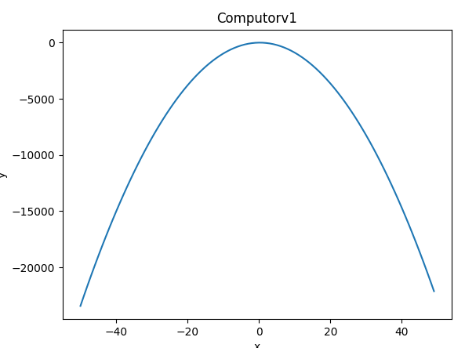

# ComputorV1 [(subject)](https://cdn.intra.42.fr/pdf/pdf/9774/en.subject.pdf)

## Introduction

This project aims to make you code a simple equation solving program. It will take polynomial equations into account. These equations will only require exponents. No complex
function. The program will have to display its solution(s).
Why polynomials? Just because it’s one of the simplest and most powerful tools in
mathematics. It is used in every field on every level to simplify and express many things.
For instance, they help calculate functions such as sin, cos, et tan.

## Objective

The idea is to get you (back) in touch with the manipulation of elementary mathematic
tools you will be able to use in seveal 42 subjects. The idea is not to "just make maths".
This exercise will allow you to approach exercises that will require these skills and knowledge with a restful mind.
Here is a non-exhaustive list of subjects that will require a basic knowledge of the
polynomials - what they are, and how to handle them:
• Fractol
• RT
• mod1
• Expert System
• Infin Mult.
Besides, this small subject will be completed with others, touching various subjects
that will help you understand what you do, rather than just copy a formula you’ve found
on the Internet.

### Install
<pre>
<code>git clone https://github.com/ChokMania/Computorv1.git</code>
<code>python -m pip install -r requirements.txt</code></pre> 

### Usage
<pre><code>usage: computorv1.py [-h] [-v] [-g] equation

positional arguments:
  equation       Equation to resolve

optional arguments:
  -h, --help     show this help message and exit
  -v, --verbose  Enable verbose
  -g, --graph    Enable graph visualisation
</code></pre>

### Exemple for ComputorV1

<pre><code>python computorv1.py "5 * X^0 + 4 * X^1 - 9.3 * X^2 = 1 * X^0"</code>
</pre>
>This will calculate a solution for this second-degree equation.
<pre><code>Reduced form: 4.0 * X^0 + 4.0 * X^1 - 9.3 * X^2 = 0
Polynomial degree: 2
Discriminant is strictly positive, so this equation got 2 solutions:
0.9052389907905898
-0.47513146390886934
</code></pre>
> Without verbose

<pre><code>Reduced form: 4.0 * X^0 + 4.0 * X^1 - 9.3 * X^2 = 0
Polynomial degree: 2

a = -9.3
b = 4.0
c = 4.0
Δ = 164.8

Discriminant is strictly positive, so this equation got 2 solutions:

x' = (-b - √Δ) / 2a
x' = (-4.0 - 12.83744522870497) / 2 * -9.3
x' = 0.9052389907905898

x" = (-b + √Δ) / 2a
x" = (-4.0 + 12.83744522870497) / 2 * -9.3
x" = -0.47513146390886934
</code></pre>
> With verbose

### Graphs

## Authors
[Kilian Botrel](https://github.com/kibotrel) et [Julien Dumay](https://github.com/ChokMania/)
